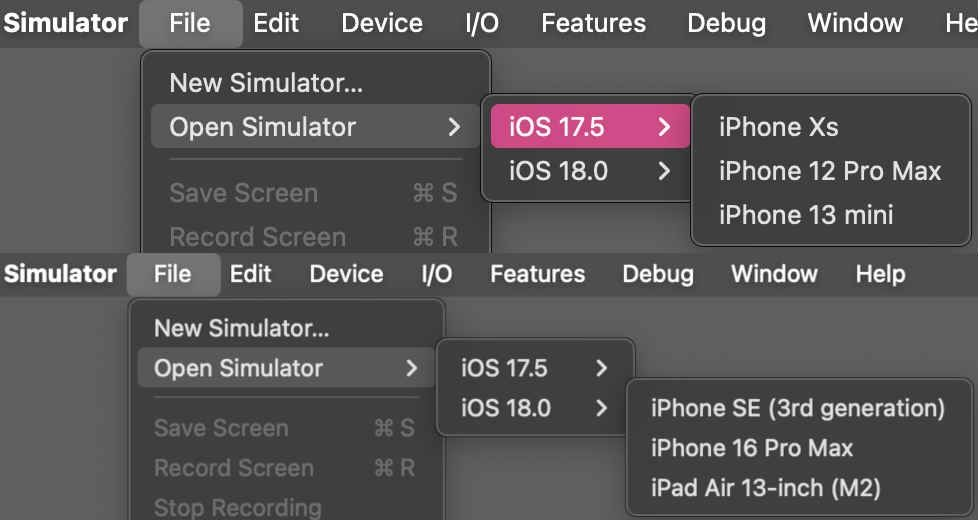
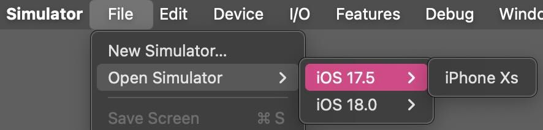

# Simulator Cleaner

This may be useful for developers who wish to without making many terminal requests either permanently delete or reset to their default settings multiple simulators at once.  


## What problem this script solves

When a new Simulator device is created, its default data is stored in a `CoreSimulator/Devices/` subdirectory. When this new device is opened for the first time, an extra 400MB - 1.5GB data is created. As different applications are tested, each device directory grows. If you remove or clear this data folder, the device becomes unopenable from Simulator's `File > Open Simulator` menu.  

The solution is to copy the chosen device type's signature data, delete the device completely, and then use that signature data to create a new device. Doing this manually is tedious.   

__Important__: This code was written on and for an Aarch64 Mac M1. You may need to change the default directory or some OS-specific commands.    


## Working walkthrough

__Scenario__: this is your current Simulator available devices configuration:



You want to delete your `iPhone 12 Pro Max` and your `iPhone 13 mini` Simulators, permanently.  
To do this, you would follow the following steps, and the terminal would look like this:  

```
Select devices to clean:
  ⬡ iPhone SE (3rd generation) [iOS-18-0] -- 17M
  ⬡ iPhone 16 Pro Max [iOS-18-0] -- 3.4G
  ⬡ iPad Air 13-inch (M2) [iOS-18-0] -- 17M
  ⬡ iPhone Xs [iOS-17-5] -- 457M
  ⬢ iPhone 12 Pro Max [iOS-17-5] -- 401M
‣ ⬢ iPhone 13 mini [iOS-17-5] -- 680M

Would you like to recreate the device?
 (Y/n) n

...

New devices state:
  iPhone SE (3rd generation) [iOS-18-0] -- 17M
  iPhone 16 Pro Max [iOS-18-0] -- 3.4G
  iPad Air 13-inch (M2) [iOS-18-0] -- 17M
  iPhone Xs [iOS-17-5] -- 457M
```

The devices would then be removed, and would no longer appear in Simulator's `File > Open Simulator > iOS 17.5` menu.    
  
__Scenario__: you now wish to clear the `iPhone Xs` of its 457 MB of data, and restore it to its default state:

```
Select devices to clean:
  ⬡ iPhone SE (3rd generation) [iOS-18-0] -- 17M
  ⬡ iPhone 16 Pro Max [iOS-18-0] -- 3.4G
  ⬡ iPad Air 13-inch (M2) [iOS-18-0] -- 17M
‣ ⬢ iPhone Xs [iOS-17-5] -- 457M

Would you like to recreate the device?
 (Y/n) y

...

New devices state:
  iPhone SE (3rd generation) [iOS-18-0] -- 17M
  iPhone 16 Pro Max [iOS-18-0] -- 3.4G
  iPad Air 13-inch (M2) [iOS-18-0] -- 17M
  iPhone Xs [iOS-17-5] -- 17M
```
  

The device has been reduced in size to the default 17MB, but still appears in and is openable from Simulator's `File > Open Simulator > iOS 17.5` menu:  



